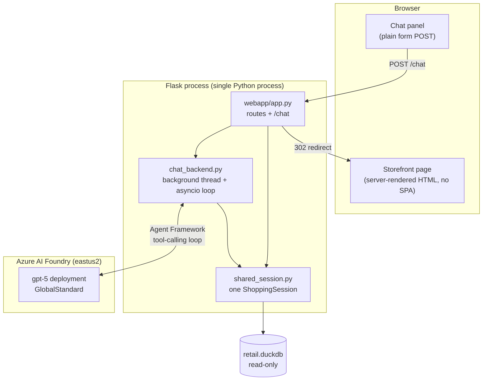

# Agentic Shopping Assistant — How It Works Today

An end-to-end conversational commerce demo: a customer describes what they want in
plain language, and an AI agent finds real products in the catalog, opens them on
screen, helps pick size and colour, offers one upsell, and completes checkout —
all inside one browser window.

This is the **GEO / Agentic Commerce Readiness** scenario (use cases #15–16 in
[`ai_native_retail_strategy.md`](ai_native_retail_strategy.md)). It is a standalone
demo, separate from the six-scenario planning proof in `notebooks/`.

> **Status:** working end to end and verified live. Everything below describes the
> system as it actually runs today, not a target design.

---

## 1. What it demonstrates

| Outcome | How it shows up in the demo |
|---|---|
| Natural-language product discovery | "Something warm and understated for a Montreal winter" → the agent translates that into structured catalog filters itself |
| Grounded recommendations | Every product, price, colour and stock figure comes from a tool call against DuckDB — the agent is instructed never to invent one |
| The store follows the conversation | When the agent looks up a product, the storefront page navigates to it automatically |
| Guided size/colour selection | The agent reads exact SKU-level stock before confirming a choice |
| Next-best-item upsell | One suggestion after add-to-cart, from a category-pairing heuristic (explicitly simulated) |
| Completed transaction | Simulated checkout produces a real order confirmation and writes an order record |

The point of the demo is that a **general-purpose agent can operate a retailer's
own commerce surface** using the retailer's own data, without bespoke intent
models or a hand-built dialogue tree.

---

## 2. Architecture



Everything runs in **one Flask process**. There is no browser automation, no
second service, and no JavaScript framework — the chat panel is an ordinary HTML
form, and each turn is a normal POST → redirect → full page render.

---

## 3. One chat turn, step by step

1. Customer types into the chat panel and submits. Inline JS disables the Send
   button and shows `...` (a turn takes seconds — without this the click looks
   like it did nothing).
2. `POST /chat` (`webapp/app.py`) appends the message to `chat_history` and calls
   `chat_backend.send_chat_message(text)`.
3. `send_chat_message` hands the coroutine to the **persistent background event
   loop** via `asyncio.run_coroutine_threadsafe(...)` and blocks on the result
   (60s timeout).
4. The Agent Framework runs its tool-calling loop against GPT-5: the model picks
   tools, the framework executes the Python functions and feeds results back,
   repeating until the model produces a final text answer.
5. If any tool call in that turn was `get_style_details`, the style_id was
   recorded as a side effect (see §6).
6. The route appends the reply to `chat_history` and issues a **302 redirect** —
   to that product's page if one was looked up, otherwise back to the referring
   page.
7. The browser reloads. The sidebar re-renders the full conversation, and the
   main pane is now showing whatever the agent was discussing.

Typical latency: **~5–11s** for a simple turn; up to **~50s** for a compound turn
that chains several tool calls (e.g. "add it and check out").

---

## 4. The tool layer — `src/agentic_commerce/session.py`

`ShoppingSession` holds the cart and one read-only DuckDB connection. Its bound
methods are passed straight to the agent as `tools=[...]`; parameter descriptions
come from `Annotated[..., Field(description=...)]` type hints, which the framework
turns into the JSON tool schema the model sees.

| Tool | What it does |
|---|---|
| `search_products` | Filter the catalog by category, gender, min warmth, max price, colour family, keyword, in-stock. Returns style-level results with price range and colours. |
| `get_style_details` | Every colour/size variant for one style with `sku_id`, price, on-hand units. **Also drives on-screen navigation.** |
| `check_availability` | On-hand inventory for one exact SKU, optionally scoped to a region. |
| `get_complementary_items` | *Simulated* upsell — category-pairing heuristic in a similar price tier. Not a behavioural recommender. |
| `add_to_cart` | Add an exact SKU; returns the line, running subtotal, and a low-stock warning if applicable. |
| `view_cart` | Current cart contents and subtotal. |
| `checkout` | Simulated checkout: totals with 8% tax, order ID, appends to `data/agentic_commerce/orders.jsonl`, clears the cart. |

**This module has no dependency on `agent_framework`.** It is plain
Python/DuckDB and is independently testable with no LLM or Azure credentials
involved — only the chat itself needs a live model.

---

## 5. The agent — `src/agentic_commerce/agent.py`

- **Model:** `gpt-5` (version `2025-08-07`), GlobalStandard deployment on an
  Azure AI Foundry **AIServices** account in `eastus2`.
- **Auth:** `AzureCliCredential` — requires `az login`. No API keys in the repo.
- **Client:** `agent_framework.openai.OpenAIChatCompletionClient` pointed at the
  classic Azure OpenAI chat-completions surface (`azure_endpoint` +
  `api_version`). See §9 for why this is *not* `FoundryChatClient`.
- **Reasoning effort:** `low`, via `build_default_options()`.
- **Persona:** a five-step instruction template — translate the ask into filters,
  describe 2–4 results naturally, pull details before confirming size/colour,
  offer exactly one upsell after add-to-cart, then check out. It ends with a hard
  constraint: *never invent products, prices, availability, or an order
  confirmation that didn't come from a tool call.*

Brand name is `Boreal`, overridable with `SHOPPING_AGENT_BRAND_NAME`.

---

## 6. How the storefront follows the conversation

There is no browser automation. `chat_backend.py` wraps `get_style_details` in
`_tracked_get_style_details`, which records the `style_id` into a module-level
variable as a side effect before delegating to the real method:

```python
def _tracked_get_style_details(style_id) -> dict:
    global _focused_style_id
    _focused_style_id = style_id
    return shop.get_style_details(style_id)
```

After the turn completes, `/chat` reads that value and redirects there. Because
the agent is instructed to call `get_style_details` *as soon as it discusses a
specific item*, the effect is that the page opens whatever the agent is talking
about — the agent isn't clicking, the storefront is following.

**Trade-off, chosen deliberately:** the alternative was driving a real browser via
Playwright/CDP so the agent literally clicks. That is more literally faithful to
"an agent using the website", but adds a second browser process, CDP attach, and
human/agent races on a shared tab. Direct tool-calling has none of those failure
modes and produces the same on-screen outcome.

---

## 7. Shared state

`shared_session.py` exports a single module-level instance:

```python
shop = ShoppingSession()
```

Both the webapp routes and the agent's tools import *that* object, so the cart is
genuinely one cart. An item the agent adds appears on `/cart`; an item added by
clicking is visible to the agent's `view_cart` and `checkout`. This is what makes
the human and the agent feel like they're in one session rather than two.

**Concurrency:** all DuckDB access inside `ShoppingSession` is serialised behind a
`threading.RLock`. The agent framework can execute multiple tool calls
concurrently within a single turn, and a DuckDB connection is not safe for
concurrent use — without the lock, compound requests like "add it and check out"
corrupted the connection and surfaced as `'NoneType' object has no attribute
'to_dict'`. Reentrant because `add_to_cart` calls `check_availability`.

---

## 8. The storefront

Plain server-rendered Jinja templates, no JavaScript framework, no build step.

| Route | Purpose |
|---|---|
| `/` | Catalog grid with category / collection / colour / warmth / keyword filters |
| `/product/<style_id>` | Detail page: colour chips, size + availability table, "Styled With" |
| `/cart`, `/cart/add`, `/cart/remove` | Cart |
| `/checkout`, `/checkout/confirm` | Simulated checkout and order confirmation |
| `/chat` | The agent turn (POST only) |

There is no product photography, so **the colour swatch is the product image**.
Every `color_name` in `silver.dim_sku` maps to a muted hex value in `COLOR_HEX`,
and each grid card is painted in that garment's actual colour. Which colourway
represents a style is chosen by `hero_color()` — a CRC32 of the `style_id` modulo
the number of colourways, so it is stable per product across page loads but
spreads the palette across the grid. (Taking the first colour alphabetically
filled entire rows with Beige/Black/Blush.)

Other details that matter on screen: warmth renders as a five-dot meter rather
than "4/5"; stock renders as a coloured dot with words rather than a raw unit
count; sizes are ordered `XS→XXL` (with numeric footwear and "One Size" handled)
by a `CASE` expression in the query, not alphabetically.

---

## 9. Notable engineering decisions

**Why not `FoundryChatClient`.** The Foundry project's `/openai/v1/responses`
surface returns a **bodyless 403** on this account. This was confirmed to be
independent of RBAC by calling both surfaces directly with `curl` using
correctly-scoped tokens: the project surface 403s while the classic
`/openai/deployments/{name}/chat/completions` endpoint on the *same resource and
same deployment* returns 200. It appears to be a gateway-level rejection. The
classic endpoint is functionally equivalent for this demo.

**Why a background thread.** Flask's dev server is synchronous, but the `Agent`
and its `AgentSession` must persist across requests to retain conversation
memory, and the underlying async HTTP client cannot be safely reused across
ad-hoc `asyncio.run()` calls in different event loops. One background thread runs
one long-lived event loop, started lazily on the first chat message so the
storefront loads instantly without touching Azure.

**Why `reasoning_effort="low"`.** GPT-5's default effort pushed multi-tool turns
to 15–60s with no visible quality gain for a scripted retail persona. `low`
brought simple turns to ~5–11s.

**Why the input is `readOnly`, not `disabled`, while a turn is in flight.**
Disabled form fields are omitted from submitted form data, so disabling the text
input on submit sent an empty message — the server bounced it and nothing ever
reached the agent. `readOnly` keeps the value in the payload.

**Model selection.** `gpt-5-nano` was deployed and benchmarked against `gpt-5`:
3–4× faster (~4–5s vs ~14–20s), but in testing it claimed no matching products
existed when they did, then filled the gap with vague un-grounded suggestions —
exactly the behaviour the persona forbids. Rejected for a customer-facing demo
and the deployment was deleted. `gpt-4o` / `gpt-4.1` were ruled out as
deprecating. `MAI-Thinking-1` is a reasoning model in preview — the wrong shape
for a latency-sensitive tool-calling loop.

---

## 10. What's real vs simulated

| Real | Simulated |
|---|---|
| Catalog, pricing, SKU-level inventory (queried live from DuckDB) | The dataset itself is synthetic (`src/retail_synth/`) |
| The agent's reasoning and tool selection (hosted GPT-5) | Upsell pairing — a category heuristic, not behavioural |
| Cart mechanics and totals (8% tax) | Checkout — no payment, no fulfilment |
| Order confirmation and order log | Order log is a local `.jsonl`, not an OMS |

Nothing in this demo writes to `retail.duckdb`; the connection is opened
read-only.

---

## 11. Running it

**One-time setup**

1. `az login` (an Azure subscription with an AIServices resource + GPT-5 deployment)
2. `copy .env.example .env` and fill in:
   - `AZURE_AI_ENDPOINT` — e.g. `https://retail-agentic-demo.services.ai.azure.com`
   - `AZURE_AI_DEPLOYMENT` — e.g. `gpt-5`
   - `AZURE_AI_API_VERSION` — e.g. `2024-10-21`
3. The dataset must be built (`python -m src.retail_synth.run_all --config config\scenario_config.yaml`)

**Run**

```
python scripts/run_webapp.py
```

Open `http://localhost:5000`. The chat panel is on every page. Azure is only
contacted lazily on the first message, so the storefront loads instantly.

`python scripts/shopping_agent_chat.py` is a terminal-only variant of the same
agent — same client, persona and tools, no webapp — for a fast sanity check.

**A demo script that exercises the whole flow**

1. *"I need something warm and understated for a Montreal winter"* → recommendations
2. *"show me the first one"* → the storefront navigates to that product
3. *"do you have it in navy, size large?"* → real SKU-level stock
4. *"add it to my cart"* → cart updates, one upsell offered
5. *"let's check out"* → order confirmation with a real order ID

---

## 12. Files

```
src/agentic_commerce/
  session.py           ShoppingSession -- the 7 tools, DuckDB, cart, checkout
  shared_session.py    the single shared `shop` instance
  agent.py             client, persona, chat options
  chat_backend.py      background thread + event loop, focused-style tracking
  webapp/
    app.py             routes, colour mapping, /chat
    templates/         base + index/product/cart/checkout/confirmation
    static/style.css   the visual system
scripts/
  run_webapp.py        starts the storefront + embedded chat (the demo)
  shopping_agent_chat.py   terminal-only agent sanity check
data/agentic_commerce/orders.jsonl   simulated order log (gitignored)
```

**Dependencies:** `agent-framework-foundry`, `azure-identity`, `flask`,
`duckdb`, `python-dotenv`. No Playwright, no Node, no frontend build.
